# 🥗 NutriData AI - Nutritional Analysis API

A study project built to consolidate knowledge in consuming external APIs with Python, developing Web APIs with FastAPI, handling JSON data, and organizing responsibilities across layers.

## Overview

NutriData AI is a Python-built API that consumes public data from Open Food Facts to search for food products, normalize nutritional information, and return a simplified, useful response for analysis.

The main goal of this project is to study, in practice, how APIs work in Python — from receiving an HTTP request to consuming an external API and handling its response.

Currently, the project includes:

- A REST API built with FastAPI
- Consumption of the public Open Food Facts API
- Input parameter validation
- External integration error handling
- Nutritional data normalization
- Layered organization: routers, services, and clients

## Learning Goal

This project was created as part of my growth in Python, especially to better understand:

- How to create endpoints with FastAPI
- How to consume external APIs with `requests`
- How to work with JSON in Python
- How to handle HTTP errors
- How to separate responsibilities in a backend application
- How to transform raw external data into cleaner, more useful responses

### Architecture

```mermaid
flowchart LR
    user["👤 User<br/>HTTP Client"]
    api["🌐 FastAPI<br/>Main application"]
    router["🧭 Router<br/>foods.py"]
    service["🧠 Service<br/>food_service.py"]
    client["🔌 Client<br/>open_food_facts_client.py"]
    external["🥗 Open Food Facts<br/>External API"]

    user -->|"HTTP Request"| api
    api -->|"Routes request"| router
    router -->|"Calls service function"| service
    service -->|"Requests products"| client
    client -->|"GET /cgi/search.pl"| external

    external -.->|"Raw JSON"| client
    client -.->|"Deserialized JSON"| service
    service -.->|"Formatted data"| router
    router -.->|"Final response"| api
    api -.->|"HTTP Response"| user
```



Responsibilities:

| Layer | Responsibility |
|---|---|
| `main.py` | Application entry point and router registration |
| `routers/` | Defines the API endpoints |
| `services/` | Contains business rules, validations, and data formatting |
| `clients/` | Isolates communication with external APIs |

## Stack

| Layer | Technology |
|---|---|
| Language | Python |
| API | FastAPI |
| Local server | Uvicorn |
| HTTP requests | Requests |
| Data source | Open Food Facts API |

## API Endpoints

| Method | Route | Description |
|---|---|---|
| `GET` | `/health` | Checks whether the API is running |
| `GET` | `/foods/search?query={value}` | Searches products on Open Food Facts and returns formatted nutritional data |

## Example Request

```txt
GET /foods/search?query=banana
```

## Example Response

```json
{
  "query": "banana",
  "total_results": 11979,
  "results": [
    {
      "name": "Yogurt Bnine BANANA",
      "brand": "Jaouda",
      "categories": "Cow milk yogurts, Flavoured yogurts",
      "calories_100g": 88.1,
      "proteins_100g": 3.9,
      "carbohydrates_100g": 14.3,
      "fat_100g": 1.7,
      "sugars_100g": 9.3,
      "sodium_100g": 0,
      "nutriscore": "c"
    }
  ]
}
```

## Error Handling

The API handles a few important scenarios:

| Status | Situation |
|---|---|
| `400 Bad Request` | Empty query or query containing only whitespace |
| `502 Bad Gateway` | Error returned by the external API |
| `504 Gateway Timeout` | Timeout while consuming Open Food Facts |

Example:

```json
{
  "detail": "Query parameter cannot be empty"
}
```

## Running Locally

### Prerequisites

- Python 3.13+
- Git
- VS Code or your preferred editor

### Clone the repository

```powershell
git clone https://github.com/zVilanova/NutriData-AI.git
cd NutriData-AI
```

### Create a virtual environment

```powershell
python -m venv .venv
```

### Activate the virtual environment

```powershell
.\.venv\Scripts\Activate.ps1
```

### Install dependencies

```powershell
pip install -r requirements.txt
```

### Run the application

```powershell
uvicorn app.main:app --reload
```

The API will be available at:

```txt
http://127.0.0.1:8000
```

Interactive documentation:

```txt
http://127.0.0.1:8000/docs
```
